## Hướng dẫn PFSense OpenVPN mode TAP

### Mục tiêu LAB
- Mô hình này sử dụng 3 server, trong đó:
  - Host Firewall cài đặt PFSense.
  - Host server_target: server trong mạng LAN (target network để kết nối VPN tới)
  - Client: cài đặt OpenVPN client.
Bài lab thành công khi máy client nhận được IP của mạng LAN và có thể kêt nối tới server_target.

## Mô hình 
- Sử dụng mô hình dưới để cài đặt
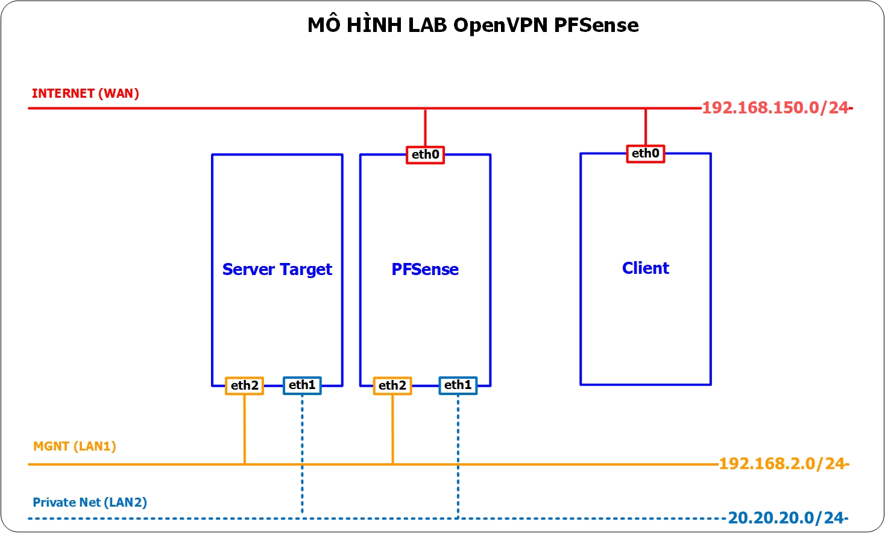

## IP Planning
- Phân hoạch IP cho các máy chủ trong mô hình trên
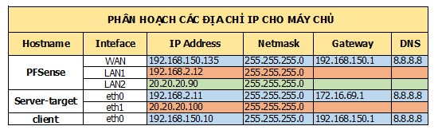

## Chuẩn bị và môi trường LAB
- Máy server_target: có thể sử dụng bất kỳ hệ điều hành và cấu hình nào.
- Máy Client: có thể sử dụng hệ điều hành Linux hoặc Windows (tùy vào loại hệ điều hành mà cài gói OpenVPN client tương ứng), trong bài lab này sẽ sử dụng OS Windows 10.
- Máy PFSense: tham khảo hướng dẫn cài đặt ở đây
 

## Thực hiện trên PFSense

### Tạo User và Certificate

- Tại tab System/Certificate Manager, tạo CA mới cho user
 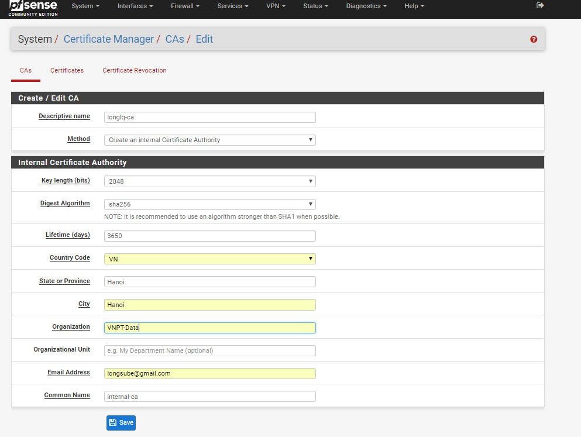
 Sau đó chọn "Save", kết quả;
 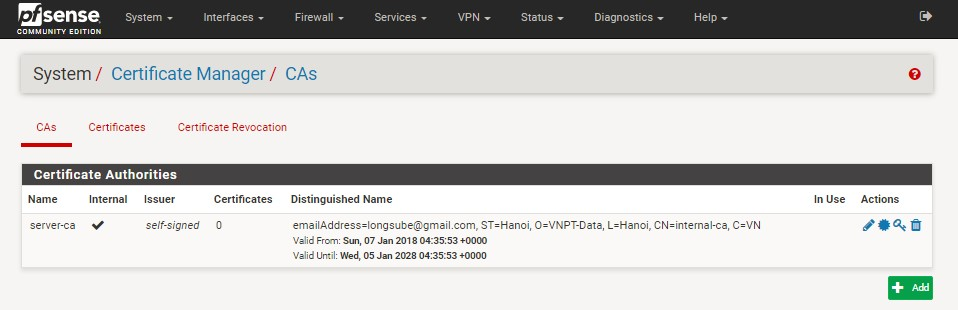
  
- Tiếp tục tạo certificate cho user
  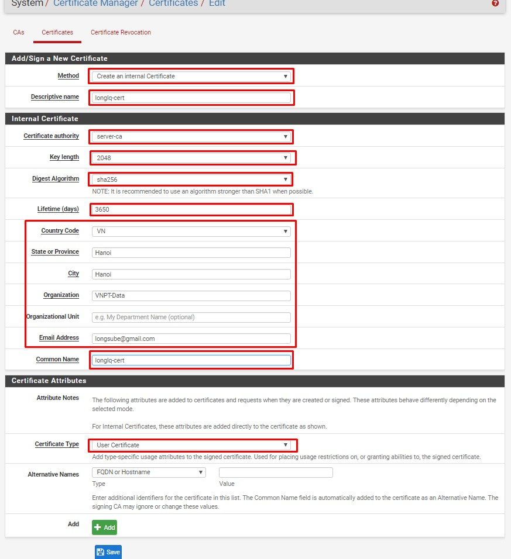

- Tại tab System/UserManager, tạo user được VPN
  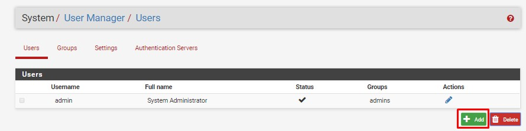

- Edit user vừa tạo, add certificate cho user đó
  

- Chọn cert vừa tạo ở trên
  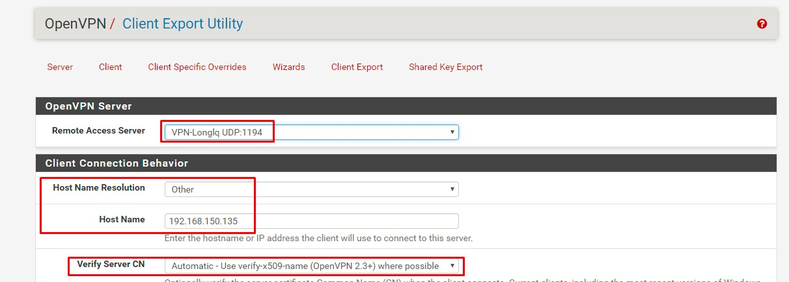

### Tạo VPN Server

- Tại tab System/Package Manager, cài đặt Plugin openvpn-client-export
  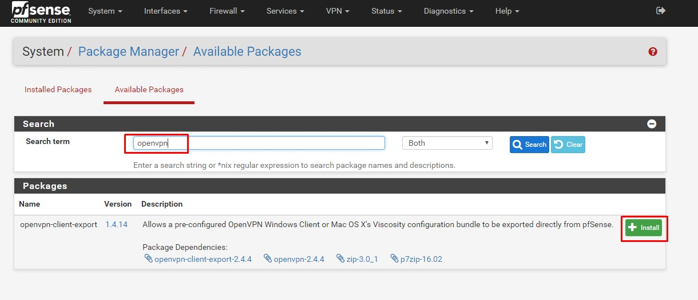
  Kết quả:
  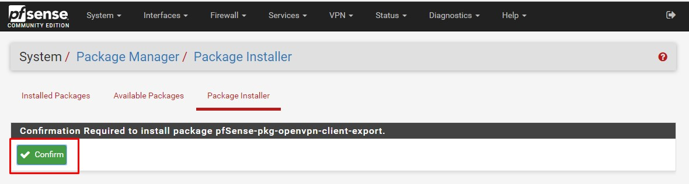     

- Tại tab VPN/OpenVPN/Servers, click "Add" để tạo VPN server
  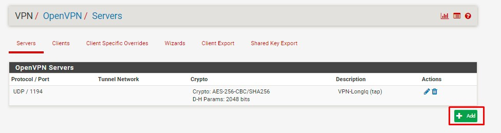

- Khai báo các thông tin về mode kết nối:
  - Server mode: Remote Access (SSL/TLS + User Auth)
  - Device mode: tap
  - Interface: WAN
  - Local port: 1194   
  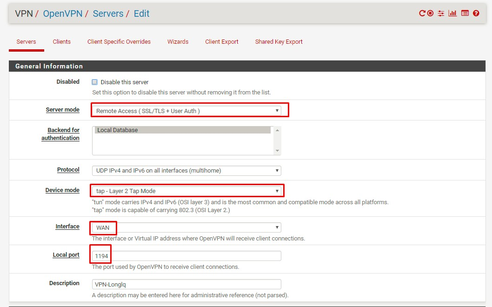 
- Khai báo các thông tin về mã hóa
  - TLS Configuration: chọn sử dụng TLS key
  - Peer Certificate Authority: chọn CA cho user được tạo
  - Server certificate: chọn cert cho user được tạo
   
- Khai báo các thông tin về tap
  - Bridge DHCP: cho phép client nhận IP trong LAN thông qua DHCP Server
  - Bridge Interface: lựa chọn LAN được kết nối qua VPN
  - IPv4 local Network: khai báo dải mạng được truy cập thông qua VPN (LAN2)
  - Concurrent Connection: khai báo số lượng client được kết nối VPN đồng thời
  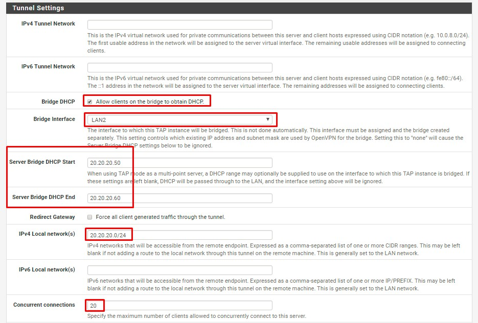
- Click "Save" để tạo VPN Server

### Cấu hình Interface

- Tại tab Interfaces/InterfaceAssignments, add thêm network port của VPN, đặt tên là vpnlab
  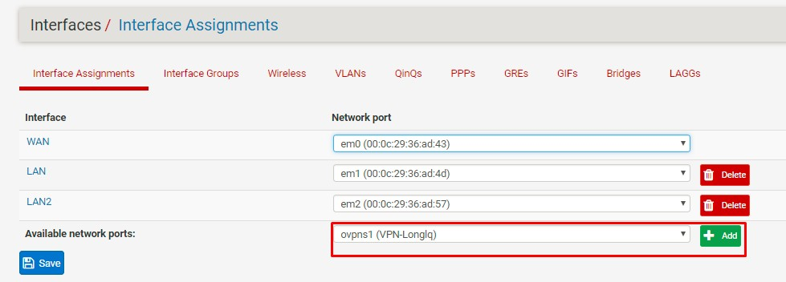

- Sửa lại các option của interface vpnlab như sau
  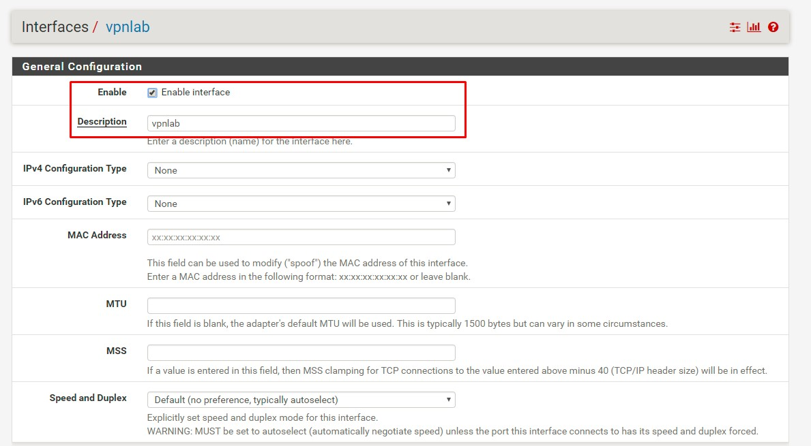

- Tại tab Interfaces/Bridges, tạo bridge mới và add 2 interface VPNLAB và LAN2 vào bridge
  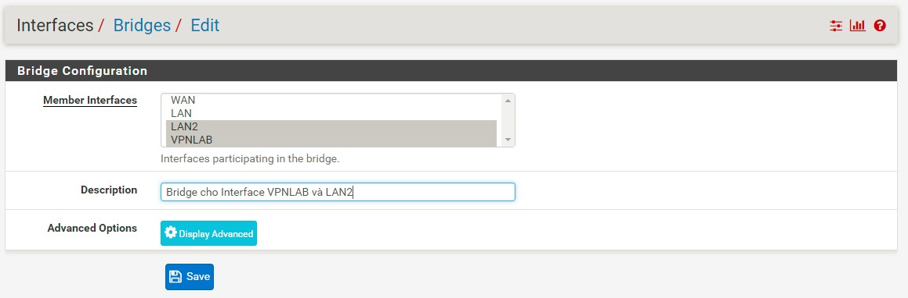

- Tại tab Interfaces/WAN, bỏ tùy chọn "BLock private network" và "Block login network"
  

### Cấu hình Firewall

- Tại tab Firewall/Rules/WAN, add thêm rule cho phép client kết nối tới port 1194 của VPN
  Khai báo các thông số như hình
  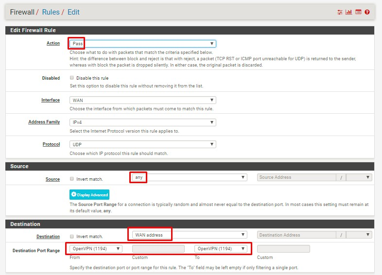

- Tại tab Firewall/Rules/LAN2, add rule cho phép lưu lượng đi qua 
  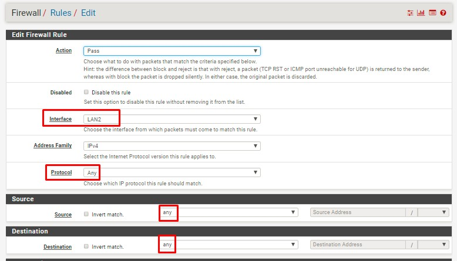

- Tại tab Firewall/Rules/VPNLAB, add rule cho phép lưu lượng đi qua 
  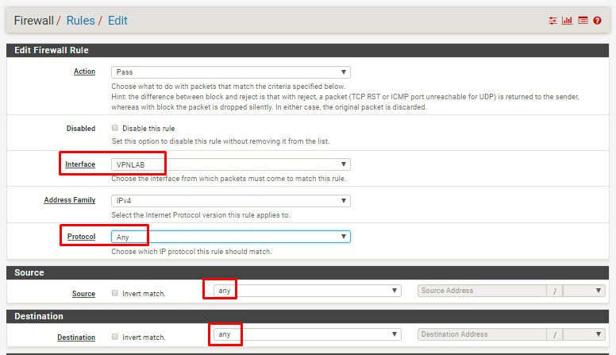

- Tại tab Firewall/Rules/OPENVPN, add rule cho phép lưu lượng đi qua 
  

### Export OpenVPN config
  - Tại tab VPN/OpenVPN/ClientExport, khai báo các thông số:
    - Remote Access Server: lựa chọn OpenVPN server
    - Hostname Resolution: lựa chọn khai báo IP của WAN
      
  - Tải gói cài đặt Openvpn config cho windows, có tên "openvpn-pfSense-udp-1194-longlq-install-2.4.4-I601.exe"
    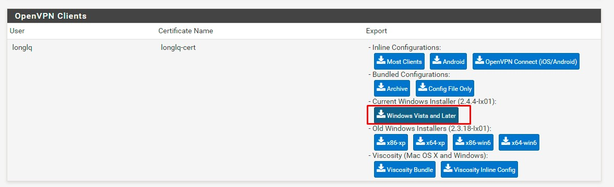

## Thực hiện trên Client, kết nối VPN
  - Trên Client, cài đặt gói OpenVPN config
  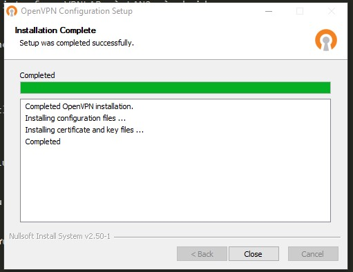

  - Kết nối VPN, nhập password của user longlq, sau khi quay VPN thành công, client nhận IP của dải mạng LAN2 của pfSense là 20.20.20.50
  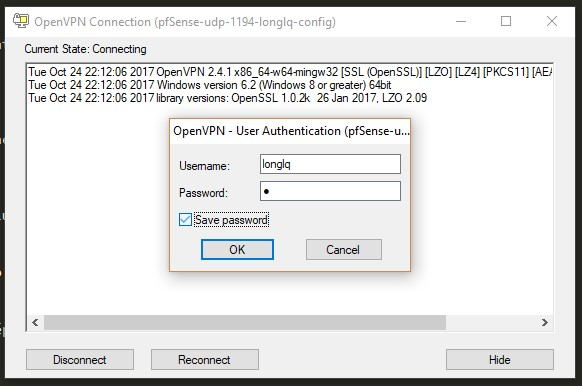
  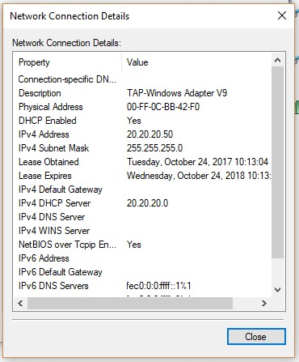

  - Từ client, đã có thể ping đến dải mạng LAN2
  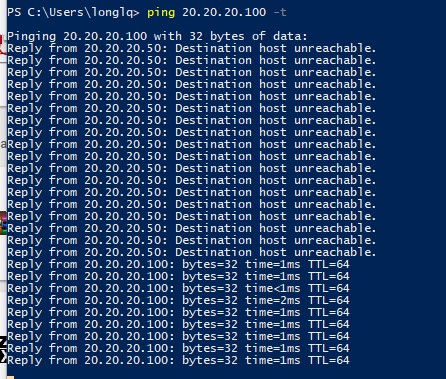

Tham khảo:

[1] - http://www.iamasuperuser.com/install-pfsense/

[2] - https://www.tecmint.com/how-to-install-and-configure-pfsense/2/

[3]- https://jacob.gardiner-moon.co.uk/2016/06/02/configure-openvpn-pfsense-2-3-1/

[4]- https://nguvu.org/pfsense/pfsense-inbound_vpn/
