## Hướng dẫn PFSense OpenVPN mode TUN

### Mục tiêu LAB
- Mô hình này sử dụng 3 server, trong đó:
  - Host Firewall cài đặt PFSense.
  - Host server_target: server trong mạng LAN (target network để kết nối VPN tới)
  - Client: cài đặt OpenVPN client.
Bài lab thành công khi máy client nhận được IP của tunnel và có thể kêt nối tới các private VLAN của server_target.

## Mô hình 
- Sử dụng mô hình dưới để cài đặt


## IP Planning
- Phân hoạch IP cho các máy chủ trong mô hình trên


## Chuẩn bị và môi trường LAB
- Máy server_target: có thể sử dụng bất kỳ hệ điều hành và cấu hình nào.
- Máy Client: có thể sử dụng hệ điều hành Linux hoặc Windows (tùy vào loại hệ điều hành mà cài gói OpenVPN client tương ứng), trong bài lab này sẽ sử dụng OS Windows 10.
- Máy PFSense: tham khảo hướng dẫn cài đặt ở [đây](./pfSense-install.md)
 

## Thực hiện trên PFSense

### Tạo User và Certificate

- Tại tab System/Certificate Manager/CA, tạo CA cho OpenVPN, CA này sẽ xác thực tất cả các certificate của server VPN và user VPN khi kết nối tới PFSense OpenVPN

 
 Sau đó chọn "Save", kết quả;
 
  
- Tại tab System/Certificate Manager/Certificate, tạo certificate cho server VPN
  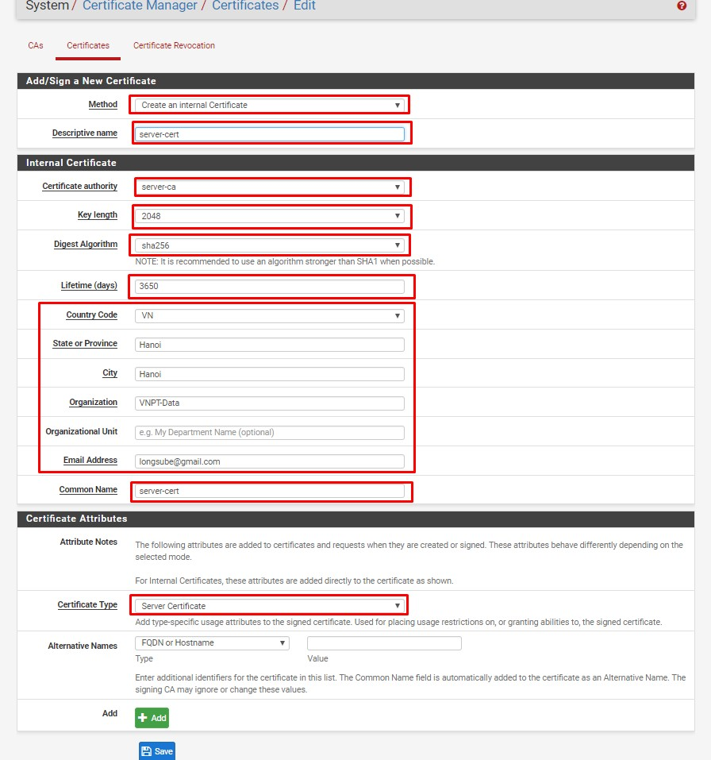

- Tiếp tục tạo certificate cho user

  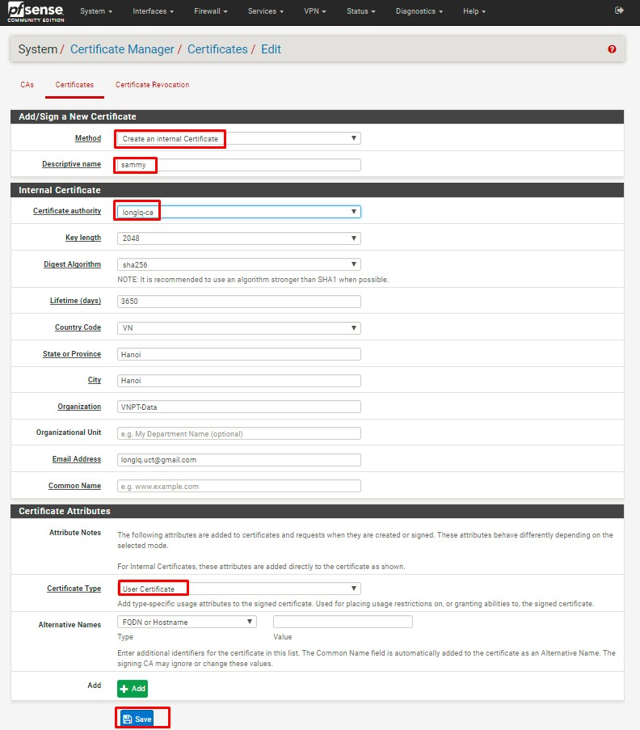

- Tại tab System/UserManager, tạo user được VPN
  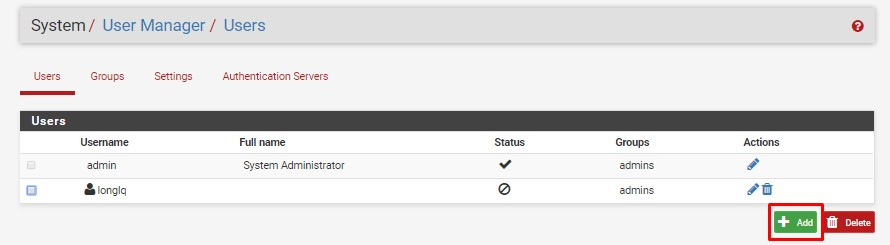

- Khai báo Username, password của User, disable quyền login của user vào pfsense, loại bỏ user khỏi group admin. Sau đó "Save"
  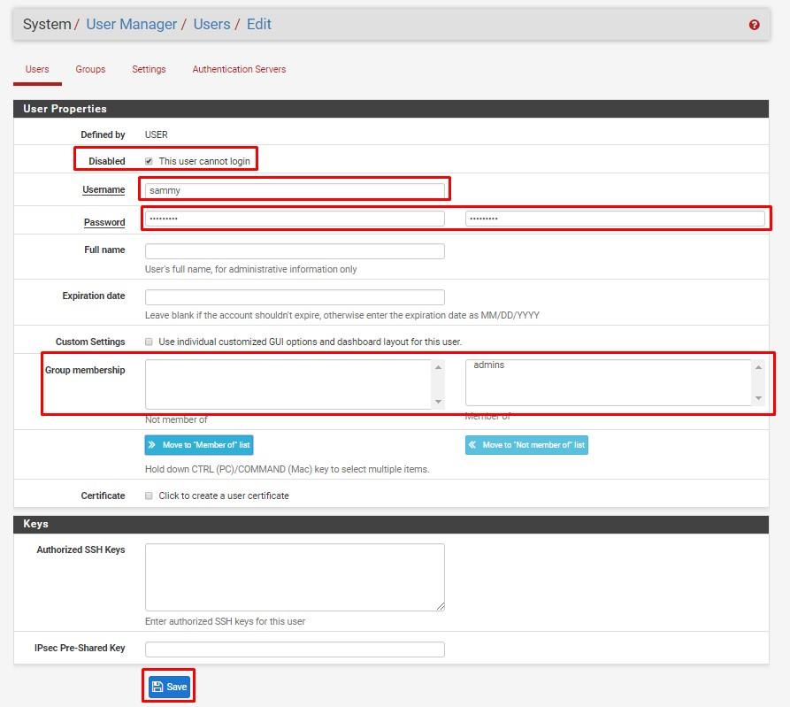

- Sau khi user được tạo, click vào nút "Edit user"
  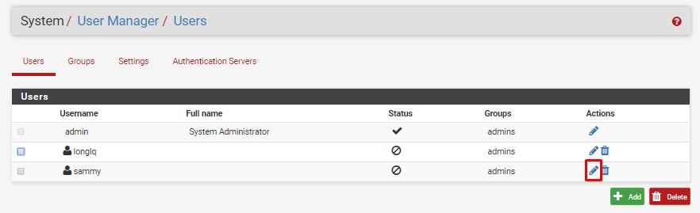

- Edit user vừa tạo, add certificate cho user đó
  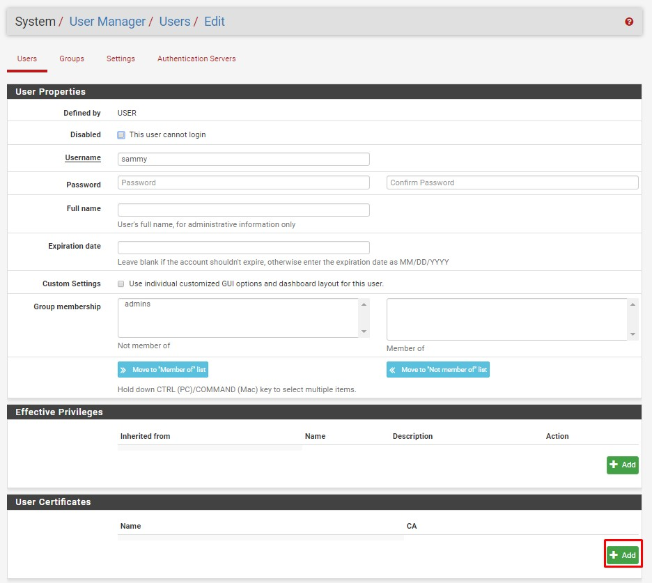

- Chọn cert vừa tạo ở trên
  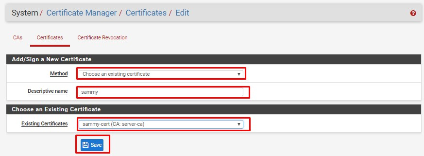

### Tạo VPN Server

- Tại tab System/Package Manager, cài đặt Plugin openvpn-client-export
  
  Kết quả:
       

- Tại tab VPN/OpenVPN/Servers, click "Add" để tạo VPN server
  

- Khai báo các thông tin về mode kết nối:
  - Server mode: Remote Access (SSL/TLS + User Auth)
  - Device mode: tun
  - Interface: WAN
  - Local port: 1195 (tùy ý lựa chọn port)   
  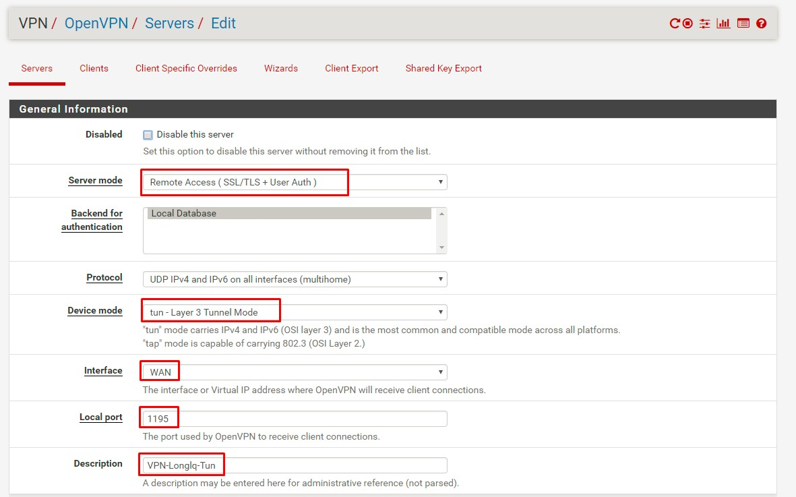 
- Khai báo các thông tin về mã hóa
  - TLS Configuration: chọn sử dụng TLS key
  - Peer Certificate Authority: chọn CA cho hệ thống đã tạo trước đó (server-ca)
  - Server certificate: chọn cert cho server được tạo (server-cert)
  - Enable NCP: lựa chọn sử dụng mã hóa đường truyền giữa Client và Server, sử dụng các giải thuật mặc định là AES-256-GCM và AES-128-GCM
  - Auth digest algorithm: lựa chọn giải thuật xác thực kênh truyền là SHA256
   
   
- Khai báo các thông tin về tun
  - IPv4 Tunnel Network: khai báo network tunnel, VPN client sẽ được route tới Private LAN thông qua network này
  - IPv4 local Network: khai báo các dải Private LAN được truy cập thông qua VPN
  - Concurrent Connection: khai báo số lượng client được kết nối VPN đồng thời
  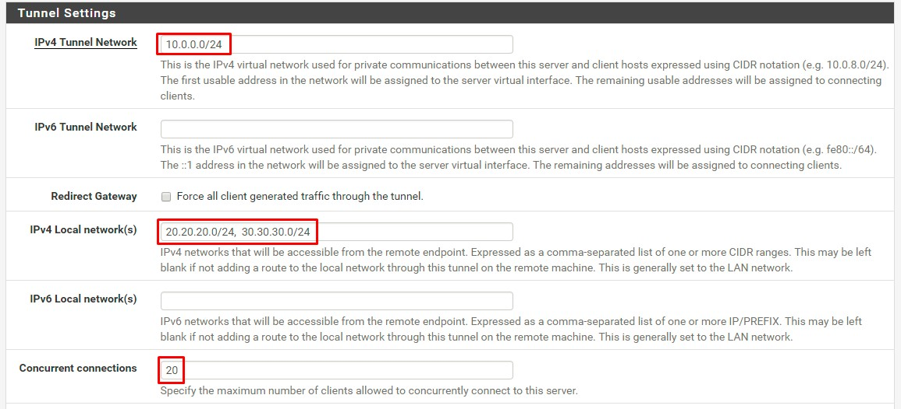

- Khai báo Private LAN được route thông qua tunnel network
  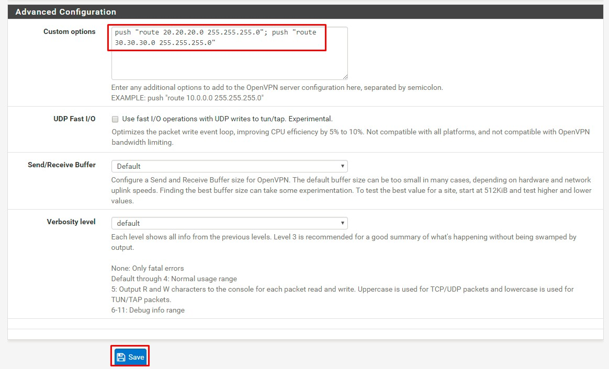

- Click "Save" để tạo VPN Server

### Cấu hình Interface

- Tại tab Interfaces/InterfaceAssignments, add thêm network port của VPN, đặt tên là vpnlabtun
  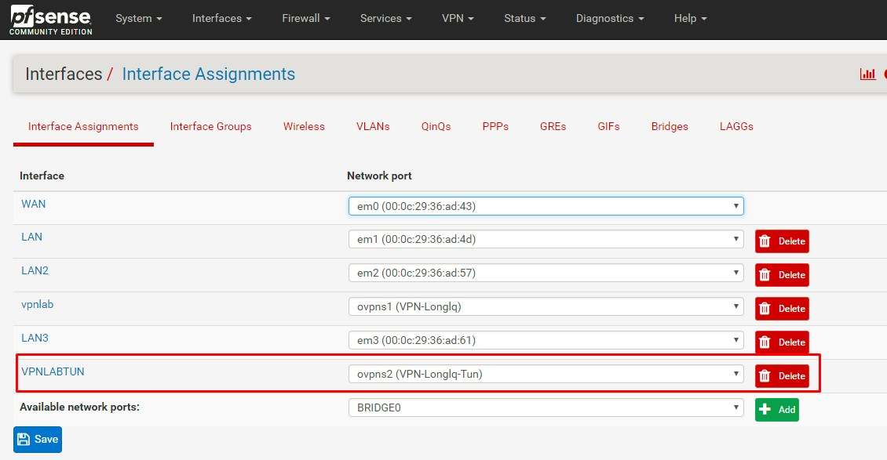

- Sửa lại các option của interface vpnlabtun như sau
  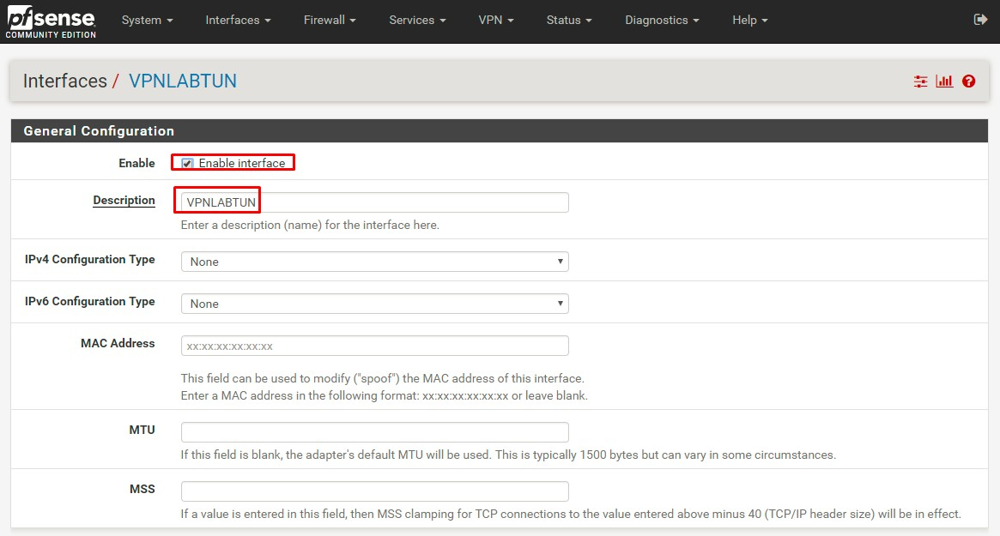

### Cấu hình Firewall

- Tại tab Firewall/Rules/WAN, add thêm rule cho phép client kết nối tới port 1195 của VPN
  Khai báo các thông số như hình
  !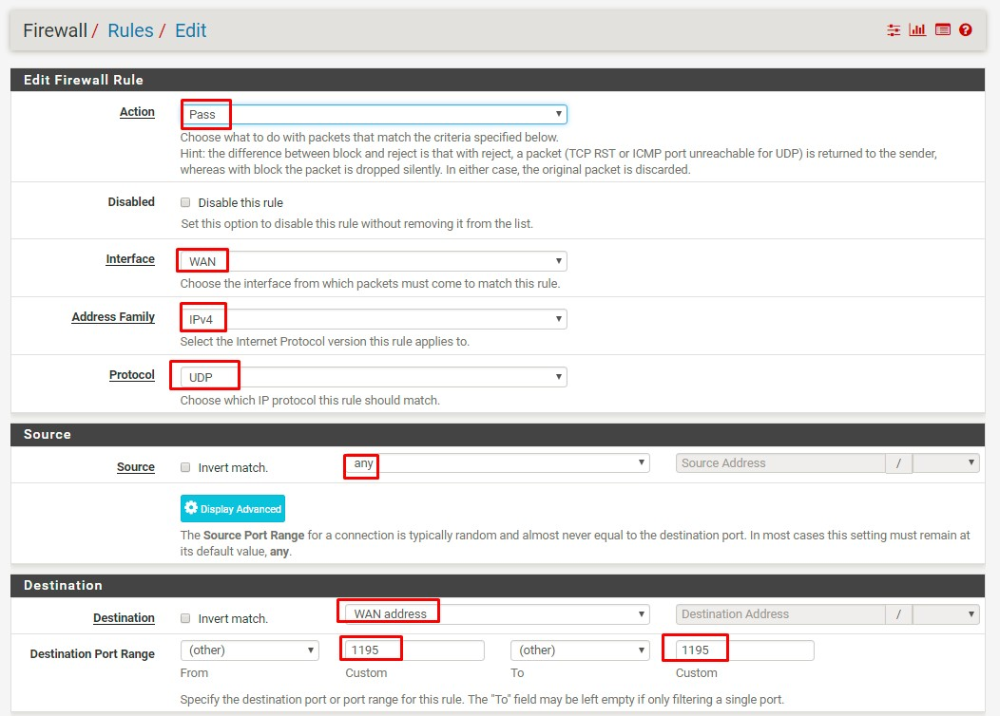

- Tại tab Firewall/Rules/LAN2, add rule cho phép lưu lượng đi qua 
  

- Tại tab Firewall/Rules/VPNLABTUN, add rule cho phép lưu lượng đi qua 
  !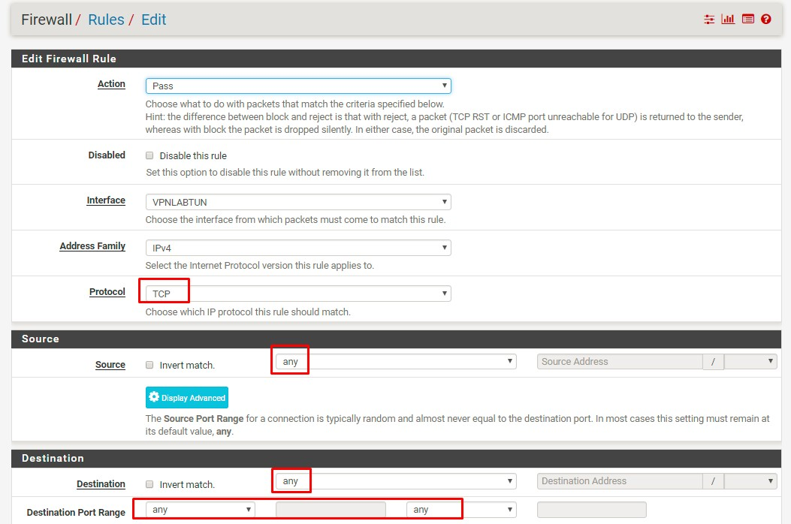

- Tại tab Firewall/Rules/OPENVPN, add rule cho phép lưu lượng đi qua 
  

### Export OpenVPN config
  - Tại tab VPN/OpenVPN/ClientExport, khai báo các thông số:
    - Remote Access Server: lựa chọn OpenVPN server
    - Hostname Resolution: lựa chọn khai báo IP của WAN
      !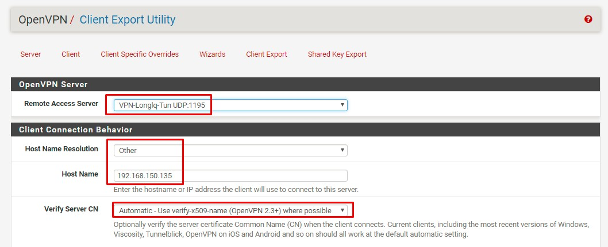
  - Tải gói cài đặt Openvpn config cho windows, có tên "openvpn-pfSense-udp-1195-sammy-install-2.4.4-I601.exe"
    !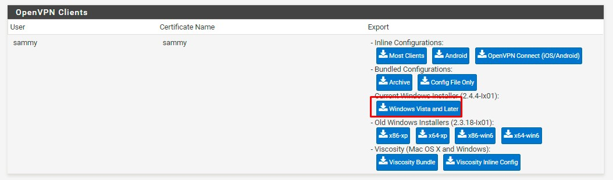

### Thực hiện trên host server_target
  - Trên host server_target phải định tuyến về dải tunnel 10.0.0.0/24 thông qua IP LAN của PFSense, trong VD này, card eth1 của server_target kết nối với dải Private LAN của VPN
    ```sh
    ip route add 10.0.0.0/24 via 20.20.20.90 dev eth1
    ```
  - Kiểm tra:
    ```sh
    route -n
    ```
    
    Kết quả:
    ```sh
    Destination     Gateway         Genmask         Flags Metric Ref    Use Iface
    0.0.0.0         192.168.2.1     0.0.0.0         UG    0      0        0 eth0
    10.0.0.0        20.20.20.90     255.255.255.0   UG    0      0        0 eth1
    ```


## Thực hiện trên Client, kết nối VPN (hướng dẫn cho Client sử dụng Windows OS Vista trở về sau)

  - Download gói cài OpenVPN mới nhất cho Windows tại link sau và thực hiện cài đặt: https://openvpn.net/index.php/open-source/downloads.html

    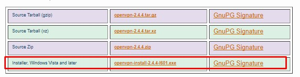

  - Trên Client, cài đặt gói OpenVPN config

    

  - Kết nối VPN, nhập password của user sammy, sau khi quay VPN thành công, client nhận IP của dải mạng LAN2 của pfSense là 20.20.20.50

    !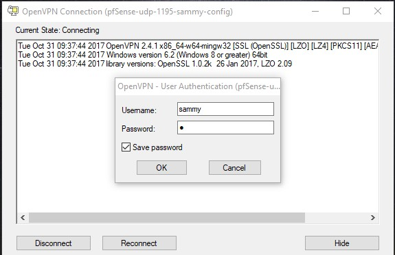
    !

  - Từ client, đã có thể ping đến dải mạng LAN, LAN2

  !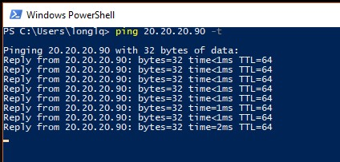
  !


Tham khảo:


[1] - https://www.tecmint.com/how-to-install-and-configure-pfsense/2/

[2]- https://jacob.gardiner-moon.co.uk/2016/06/02/configure-openvpn-pfsense-2-3-1/

[3]- https://nguvu.org/pfsense/pfsense-inbound_vpn/
