## Hướng dẫn cài đặt PFSense

### Mục tiêu LAB

Bài lab hướng dẫn việc cài đặt PFSense (sử dụng máy ảo VMWare WorkStation) và cấu hình card mạng cho PFSense.

## Mô hình 
- Sử dụng mô hình dưới để cài đặt
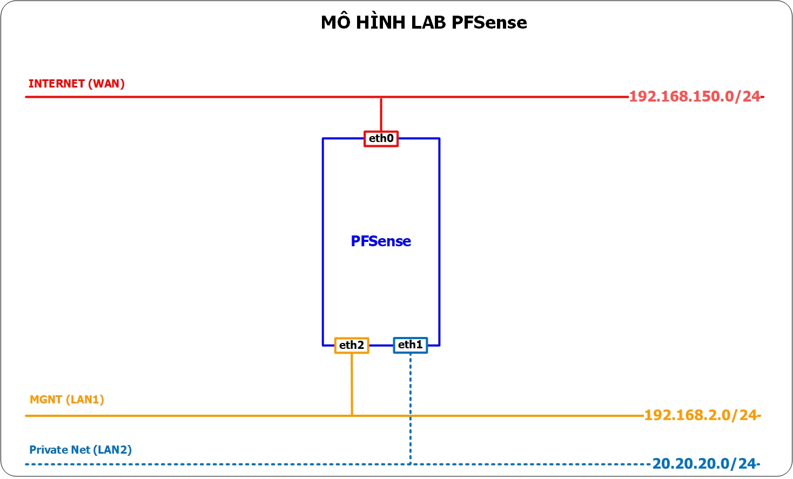

## IP Planning
- Phân hoạch IP cho các máy chủ trong mô hình trên
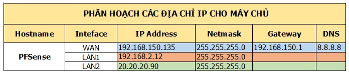

## Chuẩn bị và môi trường LAB
Hệ thống VMWare Workstation với các card mạng sau
- VMNet8: NAT ra Internet.
- VMnet3: LAN2 (giả lập mạng private trong PFSense)
- VMnet1: Host-only (quản lý PFSense)
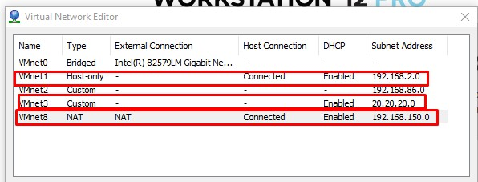
 

## Tạo máy ảo PFSense trên VMWare
- Cấu hình máy ảo và card mạng như sau:
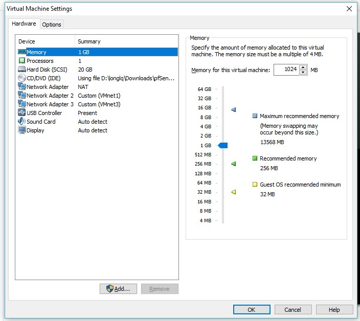
Lưu ý: OS chọn Other/FreeBSD (32 hoặc 64 tùy phiên bản)
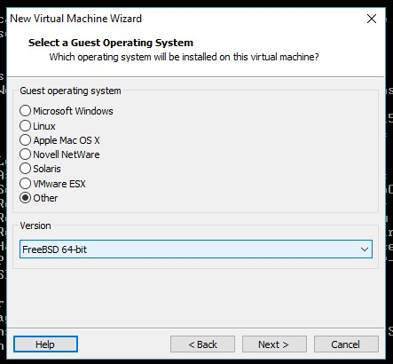

## Cài đặt PFSense
- Sau khi khởi động VM
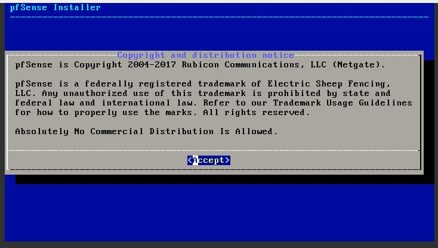

- Vào mode cài đặt pfSense
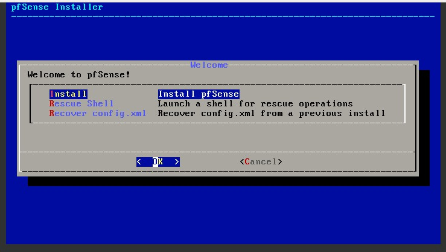

- Lựa chọn cấu hình bàn phím sử dụng
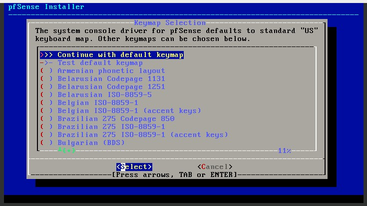

- Phân vừng ổ cứng tự động, có thể lựa chọn Manual partion (không khuyến khích)
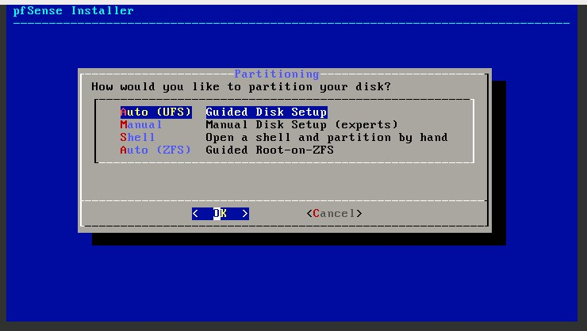
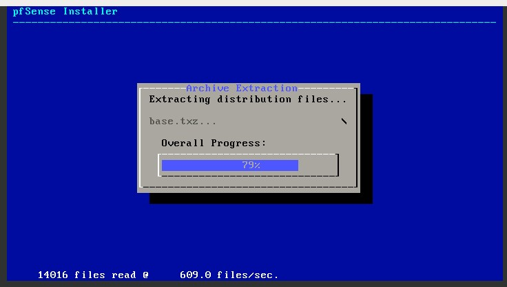

- Sau khi phân vùng sau, lựa chọn khởi động lại VM

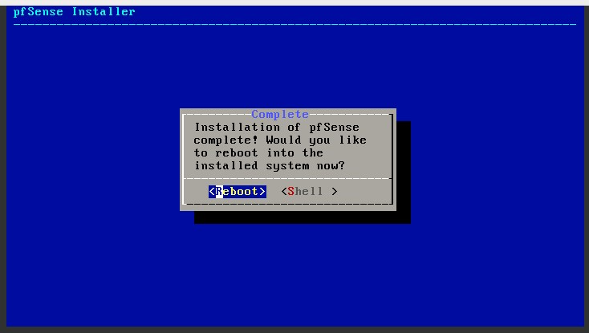

## Cấu hình card mạng cho PFSense
- Sau khi VM khởi động lại, không tạo VLAN cho PFSense
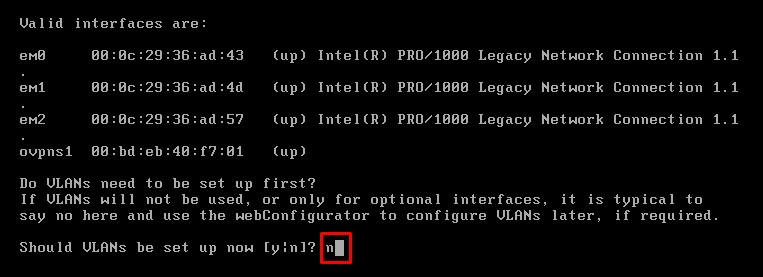

- Lựa chọn card mạng cho WAN và LAN (mặc định PFSense shell chỉ cho phép khai báo 1 card LAN, card LAN2 sẽ khai báo trên PFsense web)
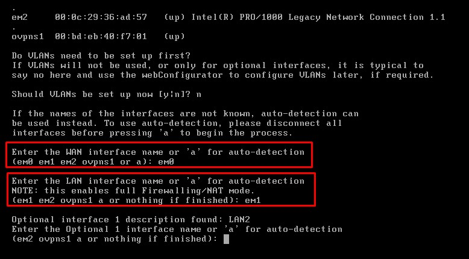
Xác nhận thông tin card mạng và chọn 'y'
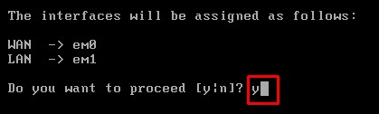

- Card mạng đã nhận IP (nếu có DHCP Server), tiếp tục chọn '2' để set ip static cho card
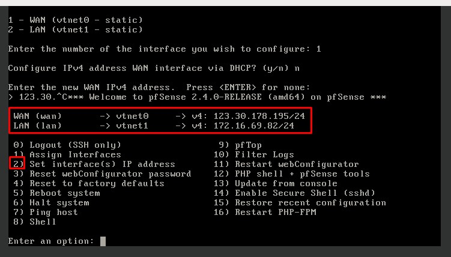

- Cấu hình IP cho card mạng WAN như sau (từ trên xuống dưới)
	- Chọn '1' để set IP cho IP WAN
	- Chọn 'no' để không nhận IP từ DHCP
	- Đặt IP tĩnh
	- Đặt subnet mask
	- Đặt Gateway
	- Chọn 'no' để không nhận IP từ DHCPv6
	- 'Enter' để không đặt IPv6

- IP đã được đặt cho WAN, "Enter" để tiếp tục đặt IP cho LAN

- Cấu hình IP cho card mạng LAN, thực hiện tương tự như WAN.
Lưu ý: không đặt gateway và IPv6 cho card LAN
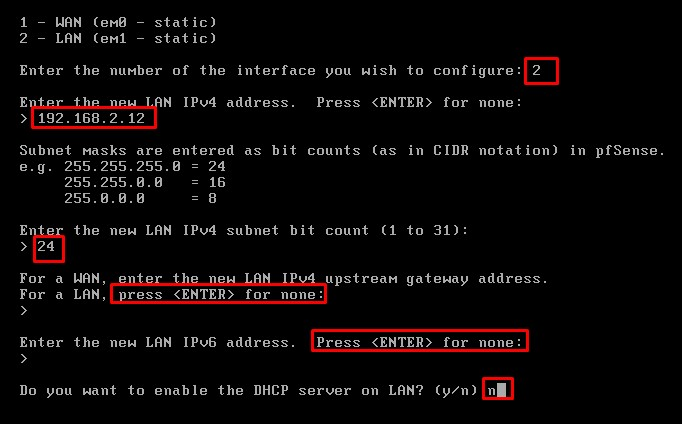

- Truy cập vào PFSense Web thông qua IP LAN
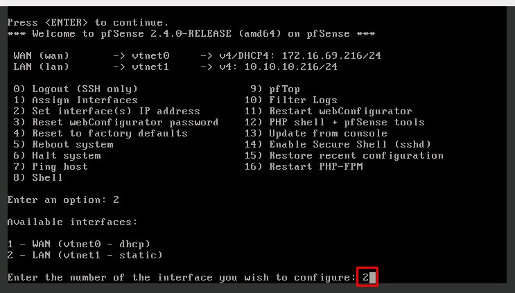
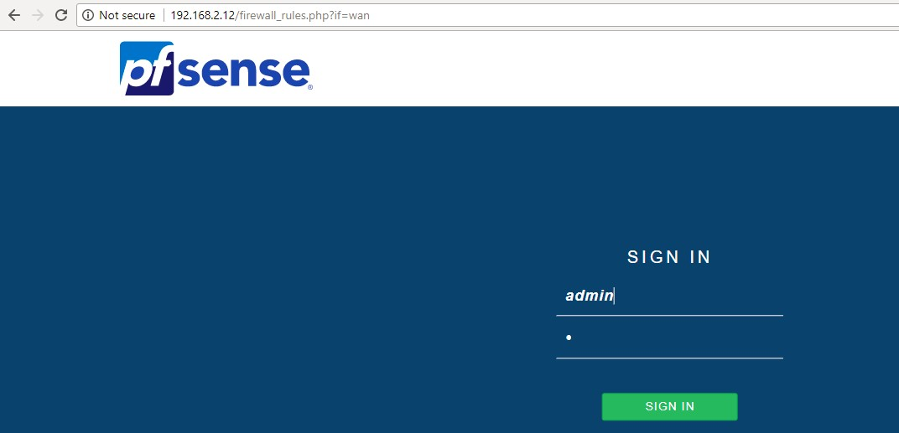

## Cấu hình LAN2 trên PFSense Web
- Tại tab Interfaces/InterfaceAssignments, add port 'em3'
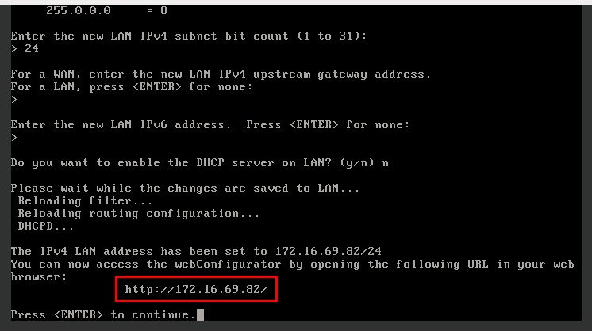

- Chỉnh sửa thông số của interface mới thêm.
	- Enable interface
	- Đổi tên interface là LAN2
	- Lựa chọn Static Ipv4
	- Đặt IP cho interface và subnet mask tương ứng

Tham khảo:

[1] - http://www.iamasuperuser.com/install-pfsense/

[2] - https://www.tecmint.com/how-to-install-and-configure-pfsense/2/

